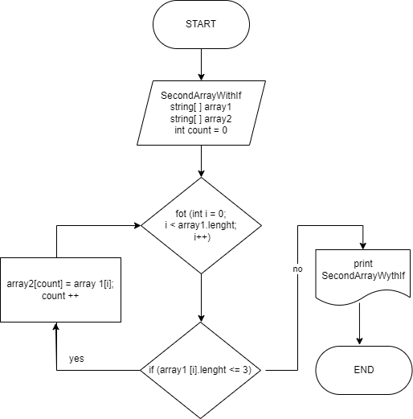

Алгоритм решения:

Изначально объявляется два массива: первый и вторый такой же длины.
Потом метод, в котором цикл соразмерный длине массива, 
внутри цикла проверка условия ( <=3 ), если да элемент первого массива
заносится в count элемент второго массива. 
Переменная count чтобы поочередно переносить из первого массива во второй, 
и чтобы потом не было пробелов.
После присвоения, переменная count увеличивается на 1 и возвращается к циклу for в котором i увеличивается на 1 и проверяем до конца.

Графическое представление метода:

